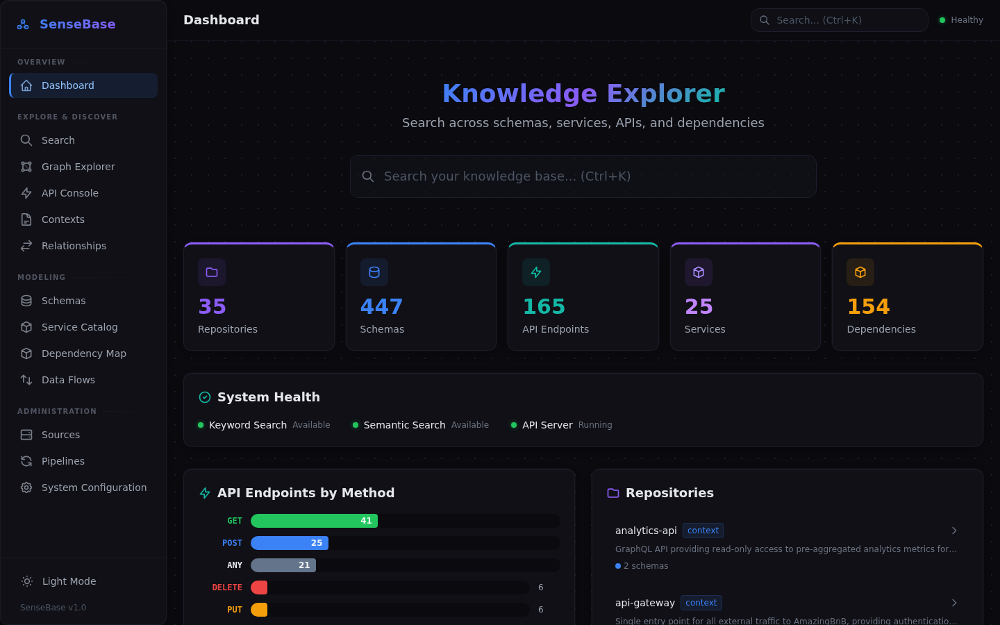
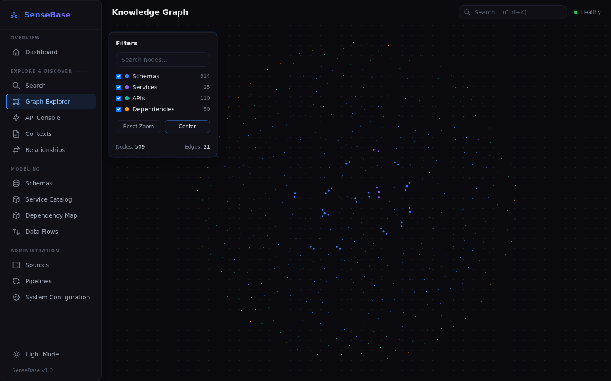
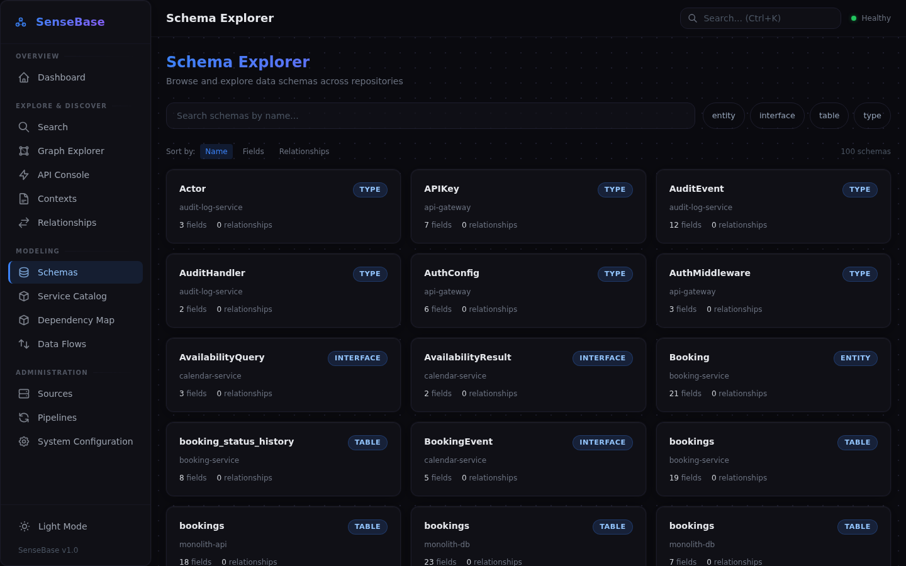
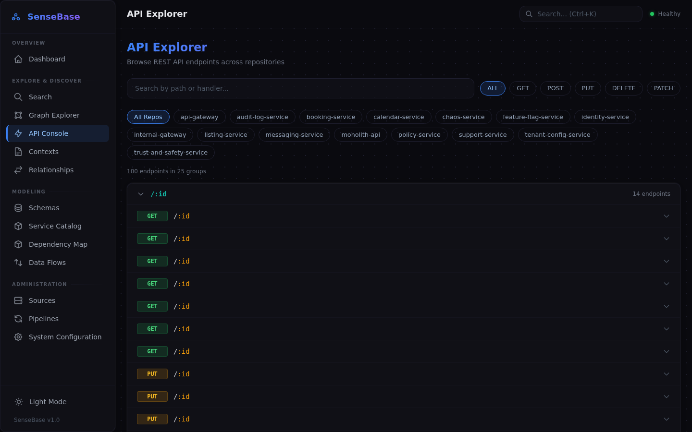
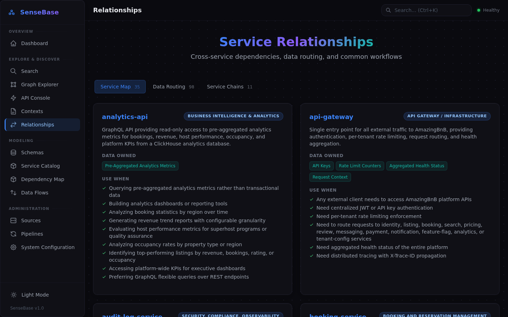
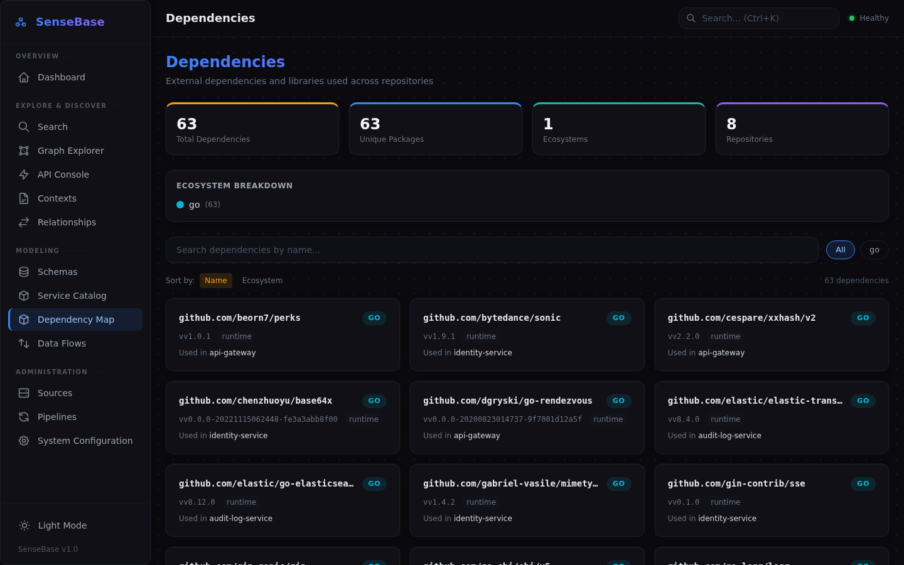
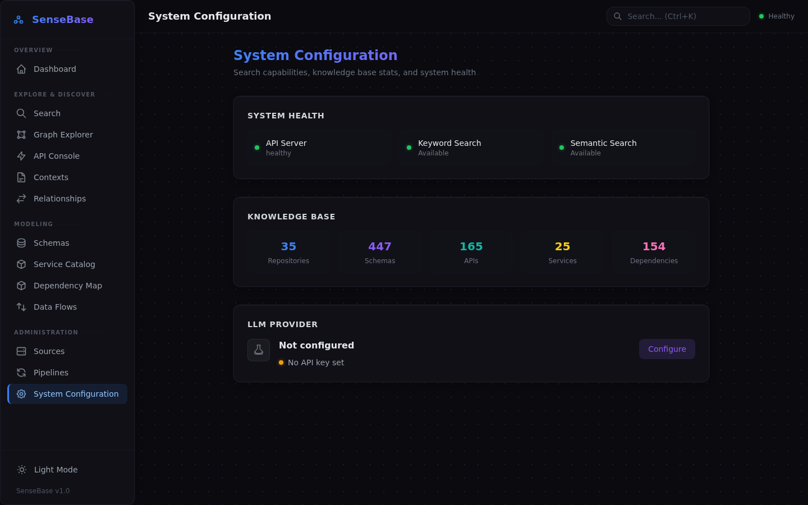
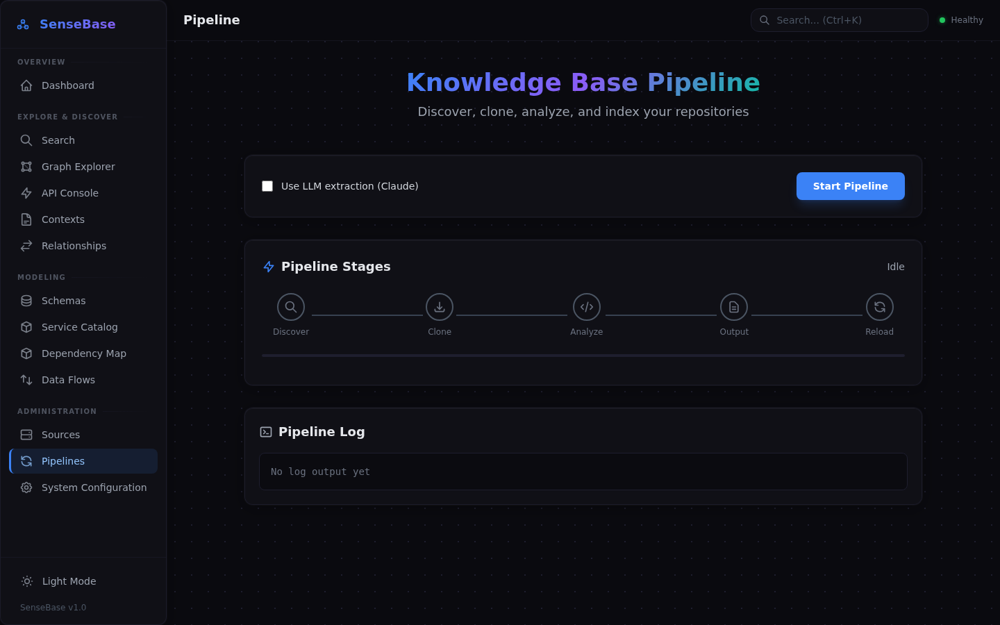
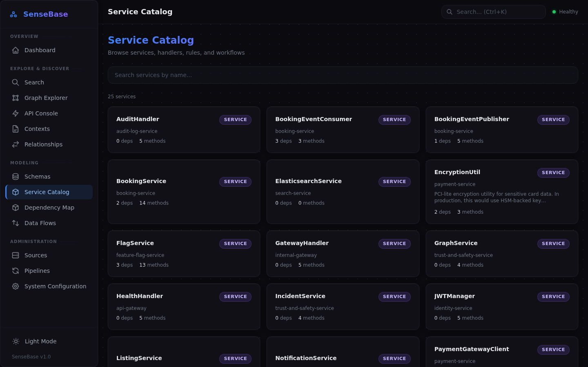
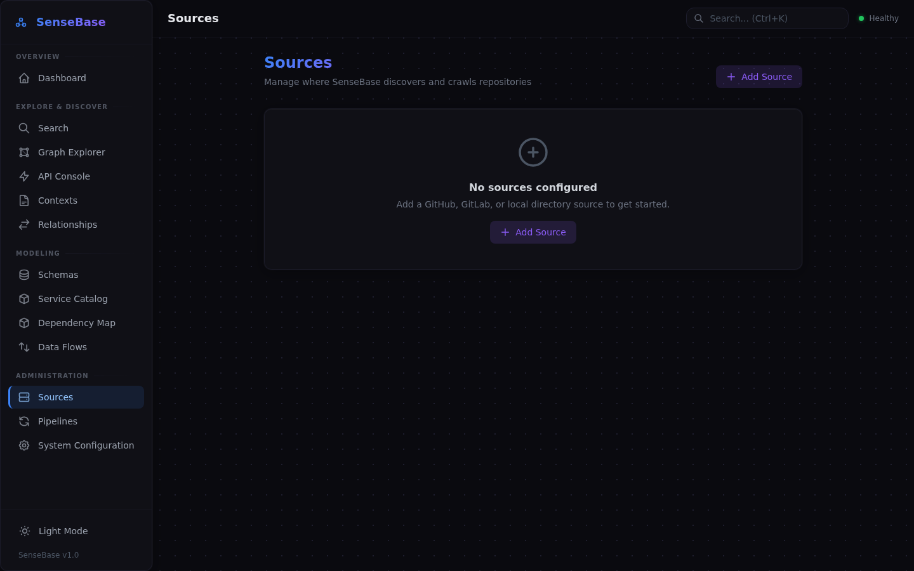

# SenseBase

A knowledge extraction system that crawls GitHub, GitLab, or local repositories to build a graph-backed ontology of business logic, data schemas, dependencies, and data flow — designed for AI agents, chat interfaces, and human search.

**[View Documentation](https://jtba.github.io/Sensebase/)**

## Screenshots

<p align="center">
  
  <br><em>Dashboard -- at-a-glance stats, system health, API breakdown, and repository list</em>
</p>

<p align="center">
  
  <br><em>Knowledge Graph -- interactive D3 force-directed visualization of schemas, services, APIs, and dependencies</em>
</p>

<details>
<summary><strong>More screenshots</strong></summary>

<p align="center">
  
  <br><em>Schema Explorer -- browse and filter all discovered data models across repositories</em>
</p>

<p align="center">
  
  <br><em>API Explorer -- view all endpoints organized by method, path, and repository</em>
</p>

<p align="center">
  
  <br><em>Service Relationships -- cross-service dependencies, data routing, and service clusters</em>
</p>

<p align="center">
  
  <br><em>Dependency Map -- track external libraries and internal dependencies across all repos</em>
</p>

<p align="center">
  
  <br><em>System Configuration -- health status, knowledge base stats, and LLM provider setup</em>
</p>

<p align="center">
  
  <br><em>Pipeline -- trigger crawl runs, monitor progress, and configure extraction options</em>
</p>

<p align="center">
  
  <br><em>Service Catalog -- all discovered services with descriptions and dependency counts</em>
</p>

<p align="center">
  
  <br><em>Sources -- configure GitHub, GitLab, or local repository sources</em>
</p>

</details>

## 🎯 Purpose

Transform scattered codebases into a graph-backed, searchable knowledge base that answers:
- "What does this data model look like?"
- "How does data flow through the system?"
- "What are the business rules for X?"
- "What depends on this service?"
- "What breaks if I change this schema?"
- "Which entities share the Auditable interface across repos?"

## 🆕 v0.2.0 — Ontology Graph Store

This release introduces an ontology-grade knowledge store inspired by Palantir Foundry best practices:

- **Graph-Queryable Store** — The knowledge base is backed by a full graph with bidirectional adjacency lists, BFS traversal, path finding, and type/name/repo indexes.
- **First-Class Link Types** — Relationships are promoted to first-class entities with cardinality (one-to-one, one-to-many, many-to-many), properties, and automatic bidirectional inverse navigation.
- **Interface Polymorphism** — Schemas sharing common field signatures across repositories are automatically grouped under inferred interfaces (Auditable, Timestamped, SoftDeletable, etc.).
- **Entity Lifecycle Status** — Every entity carries a status — active, deprecated, experimental, or draft — so consumers know what's safe to depend on.
- **Impact Analysis** — Ask "what breaks if I change User?" and get a transitive dependency graph via BFS traversal.
- **Backward Compatible** — Reads existing v1 knowledge base files and rebuilds the graph automatically.

## 🏗️ Architecture

```
┌───────────────────────────────────────────────────────────────────────┐
│                            SenseBase v0.2.0                           │
├───────────────────────────────────────────────────────────────────────┤
│                                                                       │
│  ┌──────────┐   ┌────────────┐   ┌──────────┐   ┌─────────────────┐  │
│  │ GitHub / │──▶│ Analyzers  │──▶│ Ontology │──▶│  Query Layer    │  │
│  │ GitLab / │   │ & LLM      │   │  Graph   │   │  + REST API     │  │
│  │ Local    │   │ Extractors │   │  Store   │   │  + Web Dashboard│  │
│  └──────────┘   └────────────┘   └──────────┘   └─────────────────┘  │
│                                                                       │
│  Ontology: Schemas, APIs, Services, Links, Interfaces, Lifecycle      │
│  Output: JSON | Markdown | Vectors | REST API                         │
│                                                                       │
└───────────────────────────────────────────────────────────────────────┘
```

## 📁 Structure

```
sensebase/
├── src/
│   ├── crawler/        # GitHub/GitLab/local repo discovery & cloning
│   ├── analyzers/
│   │   ├── ontology.py # Central ontology: enums, types, link types, interfaces
│   │   ├── base.py     # Core data models (SchemaInfo, APIInfo, etc.)
│   │   ├── registry.py # Analyzer registry & dispatch
│   │   └── ...         # Language-specific analyzers (Python, Java, Go, JS)
│   ├── extractors/     # LLM-powered enrichment & relationship extraction
│   ├── store/
│   │   ├── graph.py    # Graph-queryable ontology store (nodes, edges, BFS)
│   │   ├── knowledge_base.py  # KnowledgeBase with graph backend
│   │   └── output.py   # JSON, Markdown, vector output generation
│   ├── query/          # Search (keyword + semantic)
│   └── api/            # REST API server + web dashboard
├── output/
│   ├── json/           # Structured data for AI agents
│   ├── markdown/       # Human-readable documentation
│   └── vectors/        # Embeddings for semantic search
├── config/             # Configuration files
└── tests/              # Test suites
```

## 🚀 Quick Start

```bash
# 1. Configure your repo source (GitHub, GitLab, or local)
cp config/github.example.yaml config/config.yaml   # GitHub
cp config/gitlab.example.yaml config/config.yaml    # GitLab
cp config/local.example.yaml config/config.yaml     # Local directories
# Or run the interactive setup:
./setup.sh

# 2. Install with all features
pip install -e ".[full]"

# 3. Run full pipeline (pattern-based, fast & free)
sensebase --full

# OR: Run with LLM extraction (better quality, requires ANTHROPIC_API_KEY)
export ANTHROPIC_API_KEY="sk-ant-..."
sensebase --full --llm

# 4. Index for semantic search
sb-semantic --index ./output/vectors/chunks.json

# 5. Start the API server
./ctl.sh start

# Or run in foreground:
sb-api --port 8000
```

## 🧠 Extraction Modes

### Pattern-Based (Default)
Fast, free, deterministic. Uses regex/AST parsing per language.
```bash
sensebase --analyze
```

### LLM-Based
Better quality, understands business context, language-agnostic. Supports **Anthropic**, **OpenAI**, and **AWS Bedrock** providers.

```bash
# Configure via web UI at /app/#/settings, or via env vars:
export ANTHROPIC_API_KEY="sk-ant-..."   # Anthropic
export OPENAI_API_KEY="sk-..."          # OpenAI
export AWS_ACCESS_KEY_ID="AKIA..."      # AWS Bedrock

sensebase --analyze --llm
sensebase --analyze --llm --llm-model claude-opus-4-6-20250918  # Best quality
```

| Aspect | Pattern-Based | LLM |
|--------|---------------|-----|
| Speed | ⚡ Fast | 🐢 Slower |
| Cost | Free | ~$0.01-0.10/file |
| Quality | Good for structure | Excellent for meaning |
| Context | Syntax only | Business logic |
| Languages | Need extractor per lang | All languages |
| Caching | N/A | ✅ Cached results |

**Recommendation:** Use `--llm` for initial extraction (cached), pattern-based for updates.

## 🔍 Search Options

### Keyword Search (CLI)
```bash
sb-search "user account"
sb-search --schema User
sb-search --api /users
sb-search --service PaymentService
```

### Semantic Search (CLI)
```bash
# Natural language queries
sb-semantic "how do we handle user authentication"
sb-semantic "payment processing flow" --type service
sb-semantic --ask "what entities relate to orders"
```

### REST API
```bash
# Start server
sb-api --port 8000

# Endpoints available at http://localhost:8000/docs
```

## 🌐 REST API Endpoints

| Method | Endpoint | Description |
|--------|----------|-------------|
| GET | `/health` | Health check |
| GET | `/stats` | Knowledge base statistics |
| GET/POST | `/search` | Keyword search |
| GET/POST | `/semantic/search` | Semantic (embedding) search |
| GET/POST | `/ask` | Question answering (RAG context) |
| GET | `/schemas` | List schemas |
| GET | `/schemas/{name}` | Get schema by name |
| GET | `/schemas/{name}/relationships` | Get schema relationships |
| GET | `/services` | List services |
| GET | `/services/{name}` | Get service by name |
| GET | `/services/{name}/dependencies` | Get service dependency graph |
| GET | `/apis` | List API endpoints |
| GET | `/dependencies` | List dependencies |
| GET | `/dependencies/{name}/usage` | Find dependency usage |
| POST | `/semantic/index` | Reindex embeddings |
| GET | `/semantic/stats` | Embedding index stats |
| GET | `/config/llm` | Get LLM provider settings |
| PUT | `/config/llm` | Update LLM provider settings |
| GET | `/link-types` | List link types with cardinality |
| GET | `/interfaces` | List inferred interfaces |
| GET | `/graph/impact` | Impact analysis (transitive deps) |
| GET | `/graph/paths` | Find paths between entities |
| GET | `/config/sources` | Get configured repository sources |
| POST | `/config/sources` | Add/update a repository source |
| DELETE | `/config/sources/{type}` | Remove a repository source |

### Example API Usage

```bash
# Keyword search
curl "http://localhost:8000/search?q=user+authentication&limit=10"

# Semantic search
curl "http://localhost:8000/semantic/search?q=how+does+payment+work"

# Get schema details
curl "http://localhost:8000/schemas/User"

# RAG context for AI
curl "http://localhost:8000/ask?q=what+is+the+order+lifecycle"

# Impact analysis: what depends on User?
curl "http://localhost:8000/graph/impact?entity=User&depth=3"

# Browse link types and interfaces
curl "http://localhost:8000/link-types"
curl "http://localhost:8000/interfaces"
```

## ⚙️ Configuration

Configuration can be managed via the **web UI** at `/app/#/settings` and `/app/#/sources`, or by editing `config/config.yaml` directly.

- **Repository sources**: GitHub, GitLab, or local directories — see templates in `config/`
- **LLM provider**: Anthropic, OpenAI, or AWS Bedrock — configure provider, API key, and model via the Settings page or the `llm` section in config YAML

## 📊 Output Formats

### JSON (AI Agents)
Structured, typed data optimized for programmatic consumption.

### Markdown (Humans & AI Chat)
Readable documentation with cross-references and examples.

### Vectors (Semantic Search)
ChromaDB-backed embeddings using `all-MiniLM-L6-v2` for similarity search.

### REST API
Full-featured API for integration with AI agents and applications.
